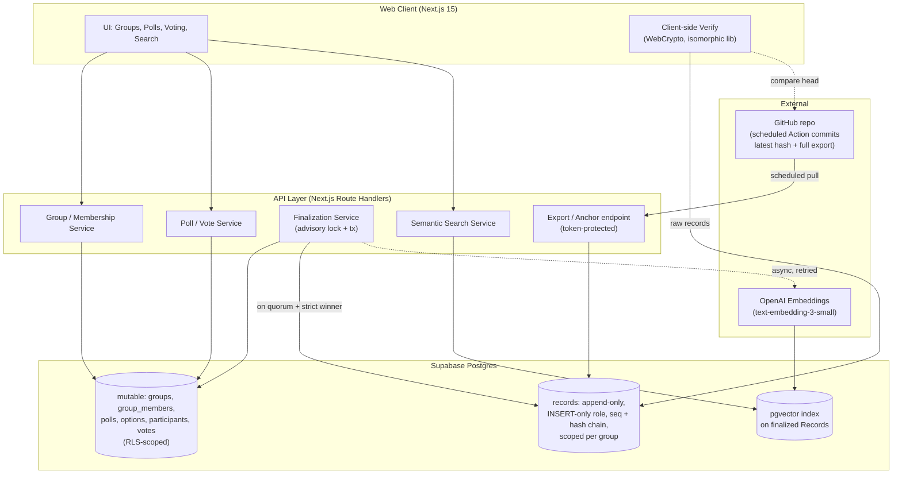
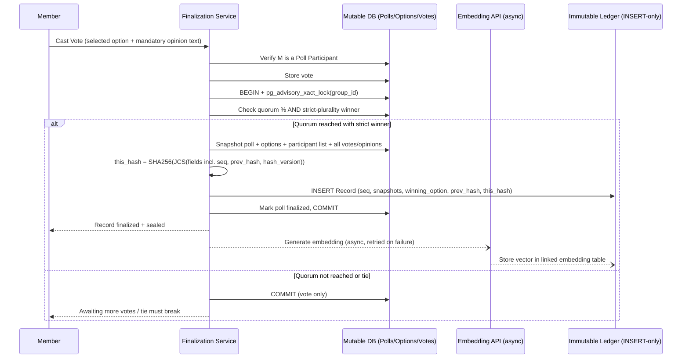
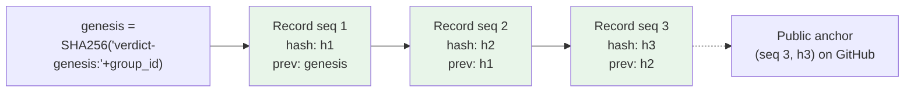
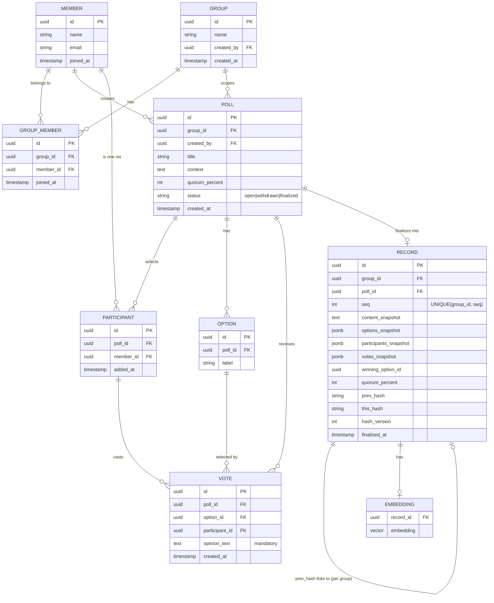

# Verdict — Product Requirements Document

**Status:** v1.1 — Approved for implementation
**Owner:** Yogi
**Last updated:** 2026-07-08

---

## 1. Problem Statement

A group of friends debates frequently. Conclusions are reached but live only in fading memory or scattered chat messages — easy to misremember, easy to "re-litigate," and impossible to prove what was actually agreed. There is no single source of truth that is:

- Recorded only after explicit agreement from participants
- Protected from silent edits after the fact (including by the person who built the system)
- Easily searchable by meaning, not just keywords, months later

## 2. Goals

- Provide a shared, web-accessible log of debate conclusions.
- A conclusion is only written once all required participants have agreed.
- Once written, a conclusion (and the opinions attached to it) cannot be silently altered or deleted — any tampering is cryptographically detectable by anyone in the group, **including by the operator/DB owner** (via external anchoring).
- Support semantic search over past conclusions ("what did we decide about X?").
- Keep the system operable by one person with no ongoing SaaS burden.

## 3. Non-Goals (v1)

- Not a general-purpose chat or debate platform — no live discussion threads (that can stay in WhatsApp/Discord).
- Not building a custom blockchain. External anchoring is a scheduled GitHub commit — **core scope**, but deliberately boring infrastructure.
- Not defending against a malicious server *at write time*: the trust model is "server honest when sealing, tamper-evident forever after." Per-member client-side vote signatures are out of scope for v1 (key management burden outweighs the threat for a friends group).
- No public/anonymous access — closed group only.
- No mobile app — responsive web is sufficient.
- No editing or "correcting" of finalized entries, ever, by design — corrections are new entries that reference the old one.

## 4. Users

- **Group members** (5–15 people): propose conclusions, record their opinion/agreement, browse and search history.
- **Admin (Yogi)**: manages membership, has zero special power to alter finalized records — this is enforced technically (INSERT-only role + external anchoring), not just by policy.

## 5. Core Concepts

| Concept | Definition |
|---|---|
| **Group** | A closed circle of members (e.g., "College Friends", "Roommates"). A member can belong to multiple Groups. |
| **Group Member** | A Member's membership in a specific Group, with a join timestamp. |
| **Poll** | A debate topic framed as a set of selectable options, scoped to one Group, mutable, in "gathering votes" state. |
| **Participant** | The subset of a Group's members explicitly selected to take part in a given Poll — defaults to all Group members, but can be narrowed. |
| **Option** | One selectable choice within a Poll (e.g., "Split by headcount" / "Split by consumption"). |
| **Vote** | A Participant's selected Option plus a **mandatory opinion** (free-text reasoning), tied to their identity and timestamp. |
| **Quorum** | A per-poll configurable threshold (e.g., 60%, 75%, 100%) of that Poll's **Participants** (not the whole Group) who must vote before the poll can finalize. |
| **Finalization** | The moment the configured quorum is reached **and a strict-plurality winner exists**; the poll, its options, and all votes are sealed into an immutable **Record**. |
| **Record** | An immutable, hash-chained entry with a per-group sequence number. Never updated or deleted after creation. |
| **Chain** | The append-only sequence of Records, scoped per Group, each cryptographically linked to the previous one within that Group. |
| **Anchor** | A scheduled external, public commit of each chain's latest `(seq, hash)` plus a full record export, so even DB-level tampering (or deletion) is provably detectable. **Core scope.** |

## 6. Functional Requirements

### 6.1 Groups & Membership
- A Member can belong to multiple Groups (e.g., "College Friends" and "Roommates" separately) — identity is shared, but membership and history are scoped per Group.
- Any Group member can invite others to that Group (or restrict invites to an admin, configurable per Group).
- Each Group has its own independent Record chain — a Poll created in one Group can never reference or mix with another Group's data.

### 6.2 Polls & Voting
- Any Group member can create a Poll within that Group: title, context, 2+ selectable Options, a **quorum threshold** (e.g., 50%, 60%, 75%, 100%), and a **Participant list**.
- **Participant selection**: by default a Poll includes all current Group members, but the creator can narrow it to a specific subset. Only selected Participants can vote; quorum is calculated against the Participant count, not the whole Group.
- **Participant list edits (resolved Q6)**: after creation, participants may be **added at any time until finalization** (adding only raises the quorum denominator, so it can never accelerate sealing). Participants may be **removed only before the first vote is cast**. This asymmetry closes the quorum-gaming hole where removing non-voters could instantly trigger finalization.
- To vote, a Participant **must** select exactly one Option **and** provide a mandatory opinion/reasoning text — a bare option selection with no reasoning is not accepted.
- A Participant can change their vote (option + opinion) freely *while the poll is still open*.
- **Finalization condition (resolved Q2, Q3)**: the poll seals when `votes_cast / participant_count ≥ quorum%` **and** exactly one Option holds a strict plurality. If options are tied at quorum, the poll simply stays open until votes change and a strict winner emerges. There is no minimum open window — quorum + strict winner = immediate seal.
- Poll creator can withdraw/cancel a Poll *before* finalization — withdrawn polls are fully discarded, nothing is recorded (resolved Q4).
- Once finalized, a Poll converts into a Record and becomes permanently read-only, including all individual opinions attached to votes.

### 6.3 Immutable Record Log
- Every Record stores: content snapshot, options, the finalized Participant list, all votes/opinions with author + timestamp, finalization timestamp, per-group `seq`, `prev_hash`, `this_hash`, and `hash_version`.
- **Canonical hashing**: `this_hash = SHA256(JCS(record_fields))` where JCS is RFC 8785 canonical JSON over the exact field list `{seq, group_id, poll_id, title, context, options, participants, votes, winning_option_id, quorum_percent, finalized_at, prev_hash, hash_version}`. `hash_version = 1` is stored on every record so the algorithm can evolve without breaking old chains.
- **Genesis**: the first record in each group's chain uses `prev_hash = SHA256("verdict-genesis:" + group_id)` — chains cannot be spliced across groups.
- **Sequencing & concurrency**: `seq` is per-group monotonic with a `UNIQUE(group_id, seq)` constraint. Finalization runs inside a single transaction holding a per-group Postgres advisory lock, so concurrent final votes cannot double-seal and a race loses deterministically on the constraint.
- No UPDATE or DELETE is permitted on finalized records — enforced at the database role/permission level (INSERT-only role) plus RLS, not just application code.
- **Client-side verification**: the "Verify Chain" page downloads raw records and recomputes all hashes *in the browser* (WebCrypto), using the same isomorphic verification library as the server — members never have to trust a server verify endpoint. It also compares the chain head against the latest public anchor.
- **Embeddings are derived data**: they are computed after sealing and are *not* part of the hash.

### 6.4 Semantic Search
- Every finalized Record is embedded (title + content + opinions summary) and indexed as a vector, **asynchronously after sealing** — an embedding-API outage can never block or fail finalization; failed embeddings are retried.
- Search bar supports natural-language queries ("what did we decide about splitting rent") and returns ranked Records by semantic similarity, not just keyword match, **scoped to Groups the searching member belongs to**.
- Filters: by date range, by participant, by tag, by Group.

### 6.5 Access & Identity
- Closed groups — invite-only membership per Group (Supabase Auth: magic link or Google OAuth).
- A member's account is global (one login), but visibility into Polls/Records is restricted to the Groups they belong to — enforced with Postgres Row Level Security, not only API checks.
- Every Vote and Record is attributable to a real member identity — no anonymous entries.

### 6.6 Anchoring & Export (core)
- A scheduled GitHub Action periodically calls a token-protected export endpoint and commits, per group: `latest.json` (chain head `seq` + `this_hash`) and a full JSON export of all records.
- Anchored `(seq, hash)` pairs make **tail-deletion** detectable, not just edits — a pure hash chain cannot detect a truncated tail on its own.
- The committed export doubles as the **backup**: durability and tamper-evidence from one mechanism. Even the operator cannot rewrite history older than the anchor interval without the public mismatch exposing it.

## 7. Non-Functional Requirements

- **Tamper-evidence over tamper-proofing**: the core guarantee is *detectability*, not physical impossibility — acceptable for this use case and dramatically simpler.
- **Durability ≠ immutability**: the chain must also survive data loss — covered by the anchor job's full export to GitHub.
- **Small scale**: 5–15 users, low write volume (a handful of Records/week) — no need for heavy infra.
- **No ongoing SaaS cost**: run on free/low-cost tiers (Supabase free tier, Vercel free tier, GitHub Actions free tier). Embedding API cost is negligible at this volume.
- **Auditable**: any member can independently verify the entire chain's integrity in their own browser without trusting the server.

## 8. System Architecture

### 8.1 High-Level Components

### 8.2 Finalization Sequence

### 8.3 Chain Verification

Verification recomputes each `SHA256(JCS(fields))` and compares against the stored `this_hash`, checks `seq` continuity (gaps = deleted records), and compares the chain head against the public anchor (mismatch or shorter chain = tampering/truncation). It runs **in the member's browser** per Group chain, using the same isomorphic library the server uses to seal — canonicalization can never drift between sealer and verifier.

### 8.4 Data Model (ER Diagram)

## 9. Tamper-Evidence Design Detail

1. **DB-level enforcement**: the `records` table is written via a Postgres role with `INSERT` privilege only — no `UPDATE`, no `DELETE`. Even a compromised or malicious app-layer bug cannot alter history through normal SQL.
2. **Hash chaining with canonical serialization**: each Record's hash depends on its own content *and* the previous Record's hash, computed over RFC 8785 canonical JSON so sealer and verifier can never disagree on bytes. Changing any past Record invalidates every subsequent hash.
3. **Sequence numbers**: `UNIQUE(group_id, seq)` makes deletions (gaps) and truncation (anchored head beyond stored head) detectable — a pure hash chain alone cannot detect a chopped tail.
4. **Snapshotting**: `content_snapshot`, `options_snapshot`, `participants_snapshot`, and `votes_snapshot` are frozen copies at finalization time, independent of the mutable tables — later edits upstream cannot affect the sealed Record.
5. **External anchoring (core)**: a scheduled GitHub Action commits the latest `(seq, this_hash)` per group plus a full export. The DB owner can rewrite the whole chain suffix and it would self-verify — only the anchor, outside the owner's DB, makes owner-tampering detectable. This is the mechanism behind "not even the admin can silently change history."
6. **Client-side verification**: members verify in their own browser against raw records + the public anchor; the server's honesty is never assumed during audit.

## 10. Tech Stack

| Layer | Choice |
|---|---|
| Frontend/API | Next.js 15 (App Router) + TypeScript, hosted on Vercel |
| Database | Supabase Postgres (free tier) with Row Level Security |
| Immutable ledger | Same Postgres, `records` table behind an INSERT-only role |
| Vector search | pgvector extension (Supabase built-in) |
| Embeddings | OpenAI `text-embedding-3-small` (async post-seal, retried; negligible cost at this volume) |
| Auth | Supabase Auth (magic link + Google OAuth) |
| Hash/verify lib | Shared isomorphic TypeScript package (Node + browser WebCrypto), RFC 8785 JCS |
| Anchoring & backup | Scheduled GitHub Action → commits chain head + full export to a GitHub repo |

### 10.1 UI Design Direction

- **Dark theme** as the primary (default) theme.
- **Pastel accent palette** drawn from shades of **blue, violet, orange, and green** — used selectively where they complement each other (not necessarily all four). Suggested mapping: violet/blue for primary actions and identity, green for finalized/verified states, orange for open-poll / awaiting-vote states.
- Responsive web layout; no mobile app.

## 11. Milestones (Phase Gates)

| Phase | Scope | Exit Criteria |
|---|---|---|
| **M0 — Integrity core** | Schema + RLS + INSERT-only role, canonical hashing (JCS) with `hash_version`, per-group `seq`, advisory-lock finalization, isomorphic verification lib, tamper-detection tests | Verification correctly detects a manually tampered row, a deleted row (seq gap), and a truncated tail in a test DB |
| **M1 — Group & poll flow** | Group creation/membership, poll creation with participant selection, add/remove rules, voting, quorum + strict-winner finalization | A poll can be fully created → participants selected → voted → finalized end-to-end, incl. tie-stays-open behavior |
| **M2 — Web UI** | Member-facing pages for groups, poll creation/voting, browsing, plus the client-side Verify page — dark pastel theme per §10.1 | Group can use it without CLI/DB access; a member can verify the chain in-browser |
| **M3 — Semantic search** | Async embedding pipeline (post-seal, retried) + pgvector search UI, scoped per Group | Natural-language query returns relevant past Records within the member's Groups |
| **M4 — Anchoring & export (core)** | Scheduled GitHub Action publishing chain head + full export; verify page compares against anchor | Anchor published, independently checkable, and restore-from-export tested |

## 12. Resolved Questions

- **Q1**: Quorum is configurable per poll — creator sets the threshold at creation.
- **Q2**: Tie at quorum → poll stays open until a strict-plurality winner emerges. No tiebreaker machinery.
- **Q3**: No minimum voting window — quorum + strict winner seals immediately.
- **Q4**: Withdrawn/cancelled polls are fully discarded; immutability begins at finalization.
- **Q5**: Embeddings via OpenAI API (`text-embedding-3-small`), computed asynchronously after sealing.
- **Q6**: Participants: **adds allowed until finalization; removals only before the first vote** (prevents quorum gaming via denominator shrinking).
- **Q7**: Group membership history is not chained; each Record's `participants_snapshot` is the permanent evidence of who took part.

---

*v1.1 incorporates the design review of 2026-07-08: anchoring promoted to core, canonical hashing specified, per-group sequencing + advisory-lock finalization added, client-side verification required, participant-edit rules locked, all open questions resolved.*
